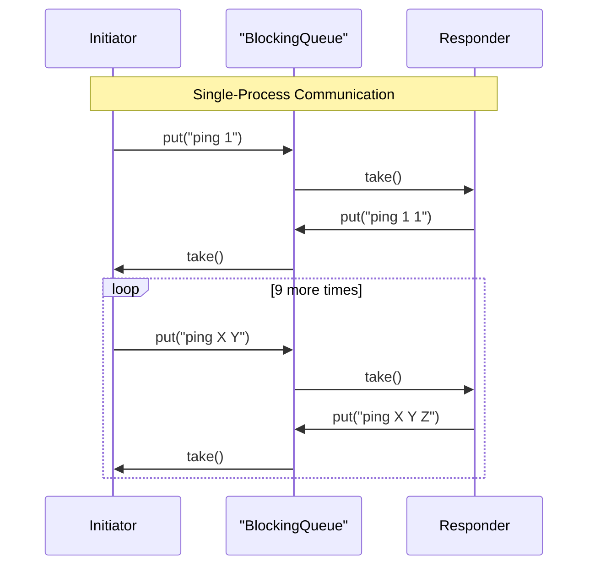
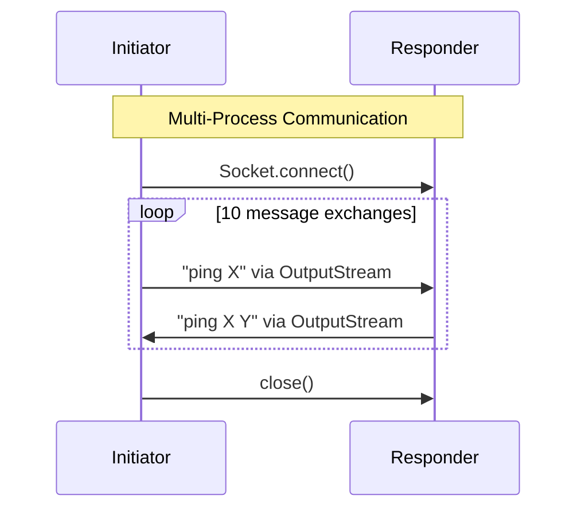
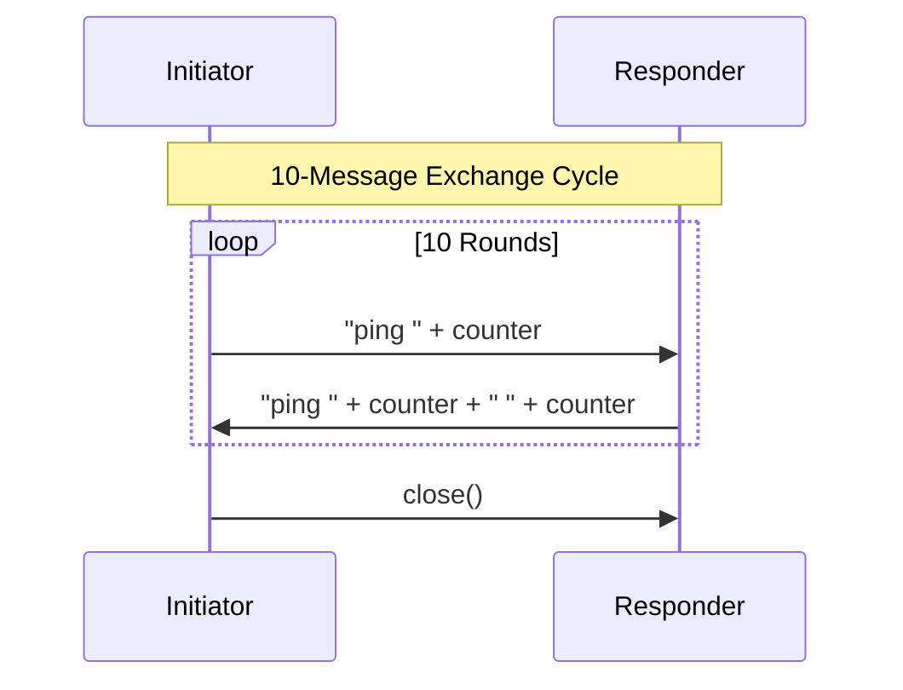

# Player Communication System

  

## Overview

A Java implementation demonstrating message passing between Player instances in:

- **Single-process mode**: Using `BlockingQueue` within same JVM
- **Multi-process mode**: Using sockets across separate JVMs

## System Architecture


## Prerequisites

```
JDK 1.8+
Maven 3.8+
```

## Build & Run

### Build project
```
mvn clean package
```
### Run single-process mode
```
mvn exec:java@single-process
```
### Run multi-process mode
```
mvn exec:java@multi-process-responder
mvn exec:java@multi-process-initiator
```
## Project Structure

```
360TRADING/
└── src/
    ├── main/
    │   └── java/
    │       └── com/
    │           └── assignment/
    │               ├── dto/
    │               │   └── Player.java
    │               └── process/
    │                   ├── multiple/
    │                   │   └── MultiProcessApp.java
    │                   └── single/
    │                       └── SingleProcessApp.java
    ├── test/
    │   └── java/
    │       └── com/
    │           └── assignment/
    │               ├── multiple/
    │               │   └── MultiProcessAppTest.java
    │               └── single/
    │                   └── SingleProcessAppTest.java
    ├── .gitignore
    ├── LICENSE
    ├── pom.xml
    ├── README.md
    └── run_all.sh
```    

## Execution Modes

```bash
bash run_all.sh
```

### Menu Option

```
1. Build project
2. Run single process
3. Run multi-process
4. Run tests
5. Exit
```

## Output

### Single Process
``` 
--- Starting Sequential Simulation ---
[Initiator] Sent: ping 1
[Responder] Received: ping 1
[Responder] Sent: ping 1 1
[Initiator] Received: ping 1 1
... (continues for 10 exchanges) ...
```
### Multi Process
``` 
--- Starting Sequential Simulation ---
[initiator Process] Starting...
[initiator] Attempting to connect to localhost:8080...
[initiator] Connection established.
[initiator] SENDING: ping 1 (Sent Count: 1)[responder]

[responder] Received: ping 1 (Total Received: 1)
[responder] SENDING: ping 1 1 (Sent Count: 1)
[initiator] Received: ping 1 1 (Total Received: 1)
[initiator] SENDING: ping 1 1 2 (Sent Count: 2)
... (continues for 10 exchanges) ...
```

## Message Flow

### Single-Process


### Multi-Process



## Complete Message Flow Diagram


## Conclusion

<p>This project serves as a practical example of implementing message passing in Java, covering both single-process and multi-process scenarios. The single-process mode demonstrates the use of `BlockingQueue` for seamless communication between threads within the same JVM, while the multi-process mode highlights the use of Java Sockets for enabling communication between separate JVMs. </p>

---

